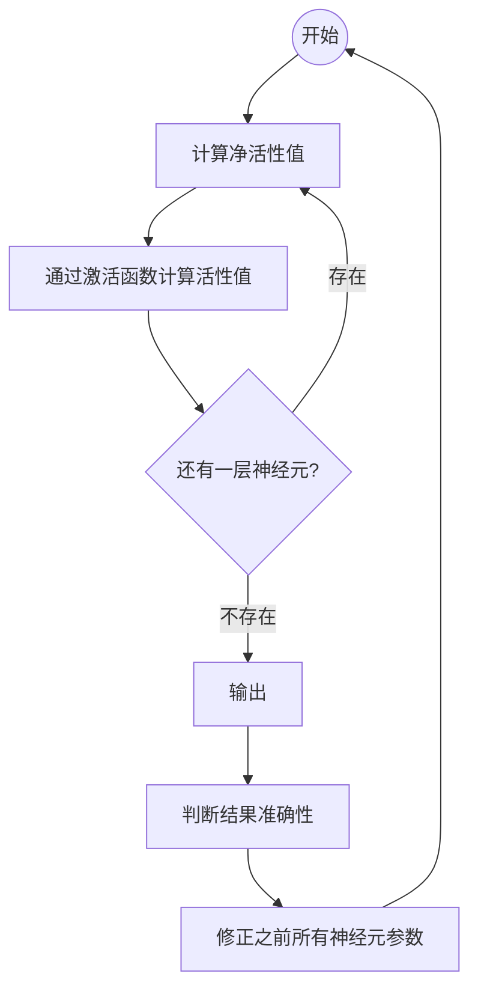

# 前馈神经网络

前馈神经网络（Feedforward Neural Network, FNN）又称多层感知器（Multi-Layer Perceptron，MLP）。

第0层称为输入层，最后一层称为输出层，其他中间层称为隐藏层。整个网络中无反馈，信号从输入层向输出层单向传播，可用一个有向无环图表示．

其中，L只考虑隐藏层和输出层。

令$a^{0}=x$，前馈神经网络通过不断迭代下面公式进行信息传播：
$$
\begin{aligned}
    z^{(l)}&=W^{(l)}a^{(l-1)}+b^{(l)} \\
    a^{(l)}&=f_{l}(z^{(l)})
\end{aligned}
$$

另一种写法：

$$
\begin{aligned}
    z^{(l)}&=W^{(l)}f_{l-1}(z^{(l-1)})+b^{(l)} \\
    a^{(l)}&=f_{l}(W^{(l)}a^{(l-1)}+b^{(l)})
\end{aligned}
$$

FNN执行流程：

