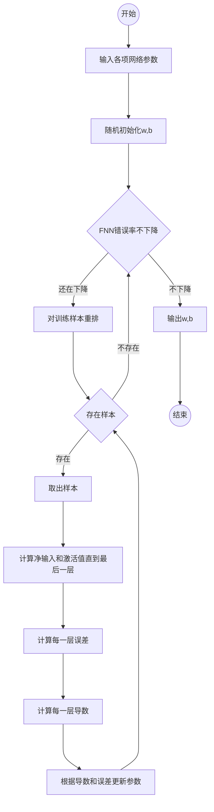

# 反向传播

反向传播：第l层的第一个神经元的误差项（敏感性）是所有与该神经元相连的第l+1层神经元的误差项的权重和，再乘上该神经元激活函数的梯度。

计算出第l+1层的误差后，就可以用来更新第l层的神经元的参数。先从第一层开始不断计算净输入和激活值直到最后一层，然后再从最后一层不断计算误差修改参数。前馈神经网络就是在这样调整整个网络的参数。

算法过程：

在以上流程中，每一层的误差为$ \delta^{(l)} $，每一层的导数为：
$$
\begin{aligned}
\forall l, &\quad \frac{\partial \mathcal{L}(y^{(n)},\hat{y}^{(n)}) }{\partial W^{(l)}} = \delta^{(l)}(a^{(l-1)})^{T} \\
\forall l, &\quad \frac{\partial \mathcal{L}(y^{(n)},\hat{y}^{(n)})}{\partial b^{(l)}} = \delta ^{(l)}
\end{aligned}
$$

因而，当前层参数可以通过以下方式更新：

$$
\begin{aligned}
W^{(l)} & \quad \leftarrow \quad  W^{(l)} - \alpha (\delta^{(l)}(a^{(l-1)})^{T}+\lambda W^{(l)}) \\
b^{(l)} & \quad \leftarrow \quad b^{(l)} - \alpha \delta^{(l)}
\end{aligned}
$$